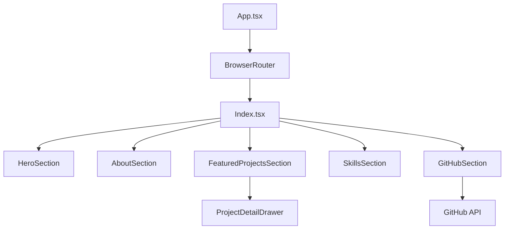

# Naresh Kamarthy: AI-Enabled Frontend Specialist

> Frontend Engineer with 5+ years designing scalable architectures and building AI-powered product interfaces.

[](https://github.com/naresh-kamarthy/naresh-kamarthy-ai-portfolio.git)
[](https://github.com/naresh-kamarthy/naresh-kamarthy-ai-portfolio/blob/main/LICENSE)

---

## 2. Mission Statement
To bridge the gap between complex AI capabilities and intuitive user experiences by engineering high-performance, accessible, and aesthetically premium frontend systems. This portfolio serves as a live demonstration of modern engineering patterns, recursive design systems, and AI-first product thinking.

## 3. Experience & Specialization
- **AI-Driven Interfaces**: Designing stateful, interactive UIs that simplify complex model outputs.
- **Frontend Architecture**: Building modular, scalable systems using React and TypeScript.
- **Immersive UX**: Leveraging Framer Motion and custom Canvas particles for engaging user journeys.

## 4. Simulation-First Architecture
The portfolio utilizes a "Simulation-First" approach, where the UI isn't just a static display but a living system.
- **Dynamic Backdrop**: Custom `ParticlesCanvas` rendering real-time interactive backgrounds.
- **Micro-Interactions**: Recursive fade-in patterns and glassmorphism for a premium feel.

## 5. Featured Projects Gallery
The gallery dynamically pulls from GitHub, highlighting high-impact AI projects based on professional curation.
- **Art Direction**: Each project features glassmorphic cards and interactive drawers.
- **Filtering**: Intelligent segregation between "Featured" and "Other Selected" projects.

## 6. GitHub Intelligence Engine
A custom hydration engine powered by `useGitHubData.ts` and TanStack Query.
- **Dynamic Filtering**: Automatically fetches repositories and filters by the `ai-project` topic.
- **Real-time Stats**: Synchronizes repository counts and metadata directly from the GitHub API.

## 7. Skills & AI-First Tech Stack
- **Core**: React 18, TypeScript, Vite.
- **Styling**: Tailwind CSS, CSS Variables, Glassmorphism.
- **Animation**: Framer Motion, custom CSS keyframes.
- **Components**: shadcn/ui, Radix UI primitives.

## 8. Performance Engine
- **Vite Optimization**: Lightning-fast Hot Module Replacement (HMR) and optimized build chunks.
- **Data Fetching**: TanStack Query (React Query) for efficient caching and stale-while-revalidate patterns.
- **Lazy Loading**: Component-level code splitting to minimize initial TTI (Time to Interactive).

## 9. Technical Stack Detail
| Category | Tools |
| :--- | :--- |
| **Framework** | React 18 (Vite) |
| **State Management** | TanStack Query, React Context |
| **Styling** | Tailwind CSS, Lucide React, Recharts |
| **Validation** | Zod, React Hook Form |
| **Utilities** | Date-fns, Clsx, Tailwind-merge |

## 10. System Architecture


## 11. Installation & Local Setup
```bash
# Clone the repository
git clone https://github.com/naresh-kamarthy/naresh-kamarthy-ai-portfolio.git

# Install dependencies
npm install

# Start development server
npm run dev
```

## 12. Verification Protocol
The project follows a rigorous testing and linting protocol to ensure production stability.
- **Unit Testing**: `npm run test` (Vitest)
- **E2E Testing**: Playwright integration for cross-browser validation.
- **Linting**: ESLint with TypeScript strict rules.

## 13. Professional License
Distributed under the MIT License. See `LICENSE` for more information.

---
© 2026 Naresh Kamarthy. Built with precision and AI-first engineering.
